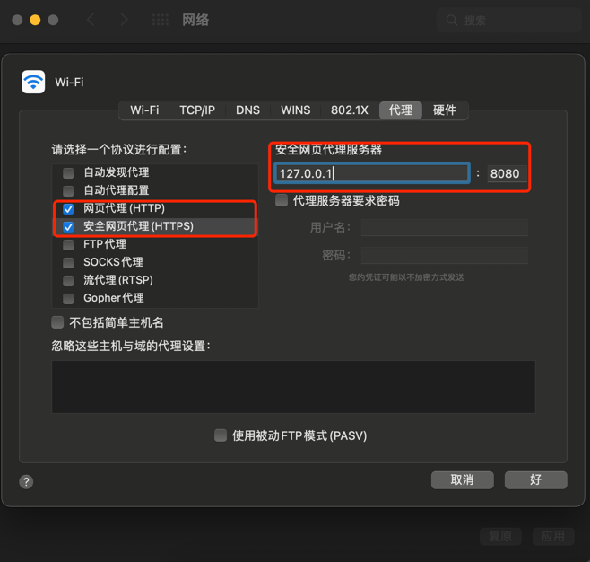
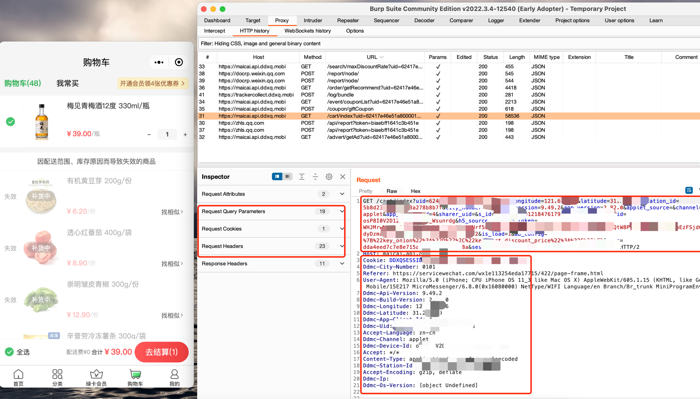
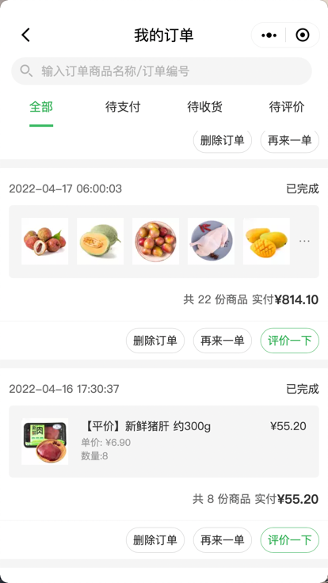
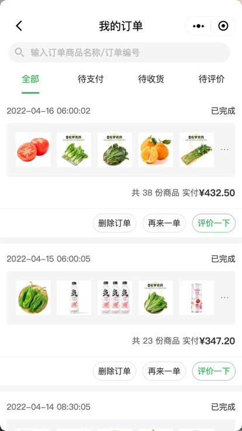

# dingdong come to my bowl 😁

[中文](./README.md) | English

1. Use burp suite to catch dingdong applet, here use mac, search by other systems
   1. [download](https://portswigger.net/burp/releases/professional-community-2022-2-4?requestededition=community)
   2. open burp suite install the cert rename ca.der
   3. Import burp suite certificate locally
   4. set burp suite proxy on WIFI 127.0.0.1:8080
      
2. open weChat `dingdong` mini program and burp suite
3. open burp suite of proxy http history copy api token and headers info
   1. click `dingdong` mini program cart grasp api `/cart/index`
      copy url query param and headers info
      
   2. Fill in the information in the headers and userinfo functions
4. cart ready and select all
5. start `go run .`
6. order success need own pay, Let's wish the epidemic will end soon 🍻！！

# feature
1. add run application,run the command as follows

   ./dingdong `-f config.yaml -aid address_id`

   `aid` run is empty,default find address_id

   `f` Add URL query param and header info required information to the configuration file
   
2. customize the scheduled time to grab the order

   (1) 6:30-14:30
   
   (2) 14:30-22:00

   `reserve` runs empty, default is 1

# actual combat

